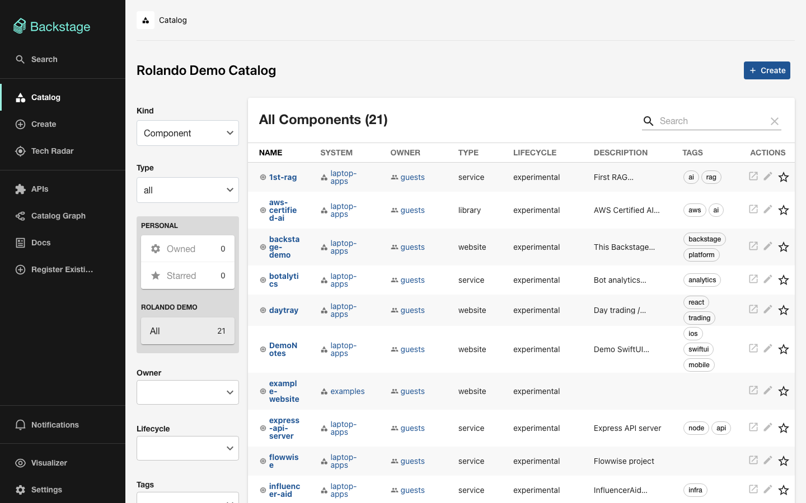
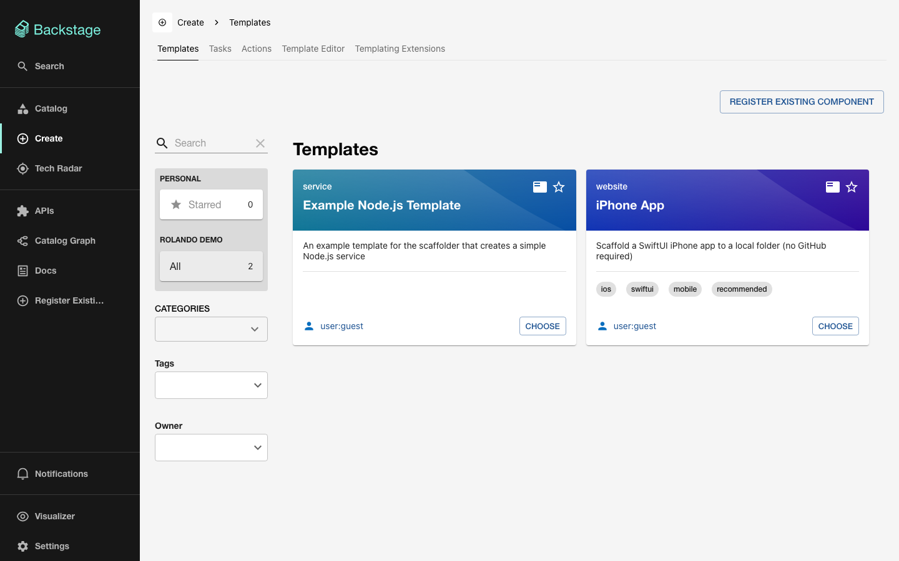
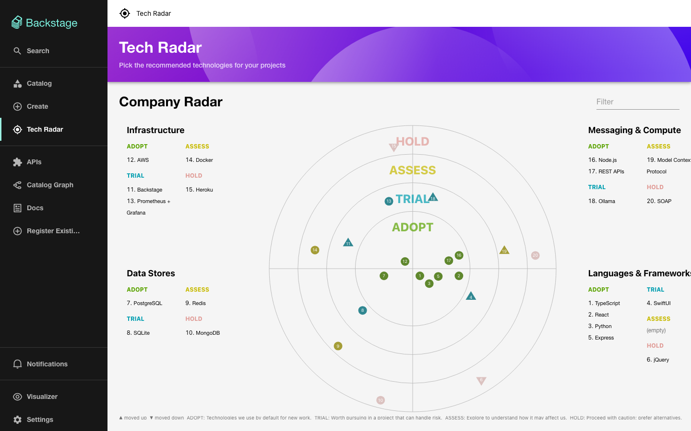
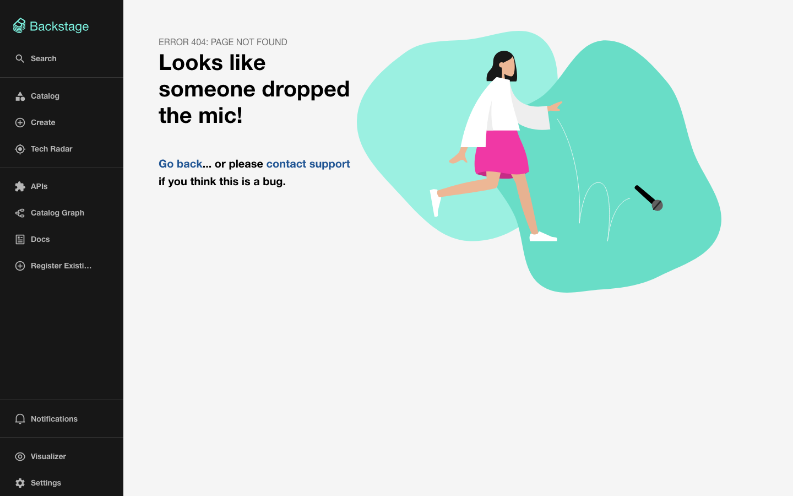
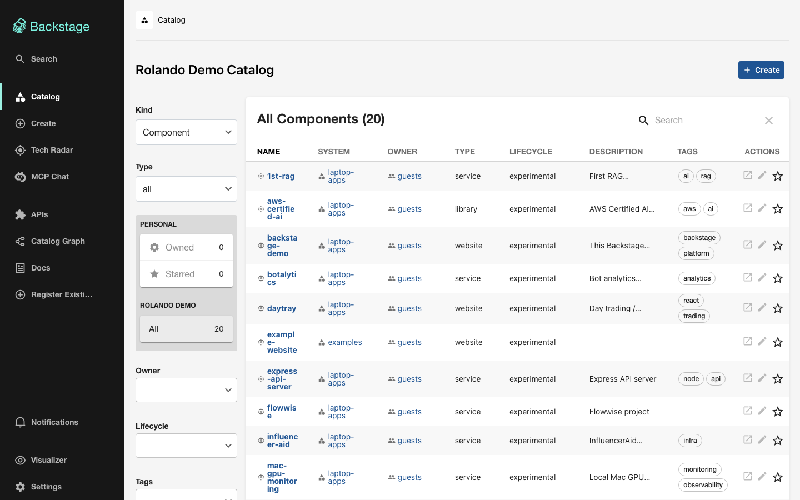
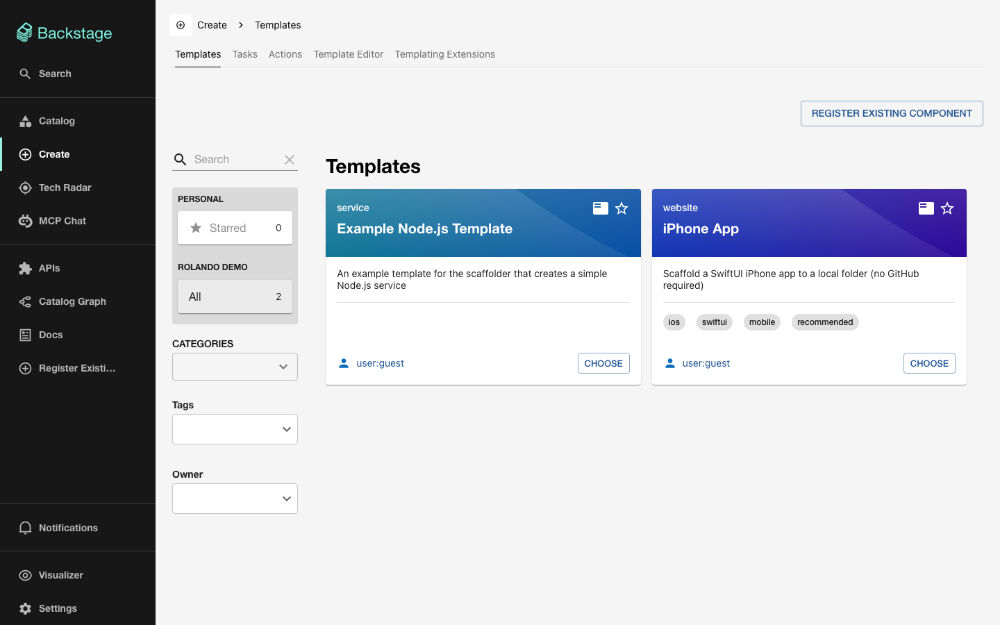
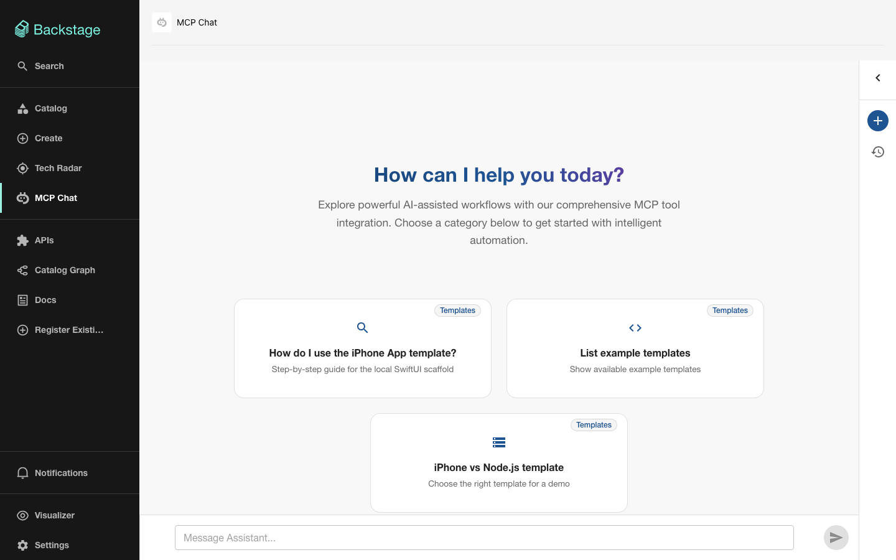

# Build-and-test report

| Field | Value |
|-------|-------|
| Date | 2026-08-10T224656 |
| Branch | `build-and-test/mcp-chat-templates-20260810` |
| MR / PR | https://github.com/rcintron1/backstage-demo/pull/1 |
| Prompt summary | Chatbot using local MCP (template how-to) + Ollama `qwen2.5:7b-instruct` |
| Overall | **PASS** |

## Change brief

- Goal: Add a Backstage chatbot that uses local Ollama (`qwen2.5:7b-instruct`) and a locally run MCP server with guidance on how to use the example Software Templates.
- Surfaces touched: MCP Chat page/sidebar, `mcp-servers/template-help`, Ollama provider config.
- Build target: `yarn tsc`, `yarn test`, `yarn start` (web portal).
- Full-function areas: Chat answers template how-tos via MCP tools; Ollama responds.
- Regression areas: Catalog (laptop-apps), Create / iPhone template, Tech Radar.

## Timeline

1. MR created: 2026-08-10 — https://github.com/rcintron1/backstage-demo/pull/1
2. Baseline completed: 2026-08-10
3. Changes applied / build green: 2026-08-10 (MCP Chat + template-help MCP + Ollama)
4. After-test completed: 2026-08-10

## Baseline (before)

### Automated suite

- Command: `yarn tsc && yarn test --watchAll=false --passWithNoTests`
- Exit code: 0
- Log: `before/test-output.log`

### Performance

| Metric | Before |
|--------|--------|
| Suite wall seconds | 9.71 |
| Notes | tsc 2.85s + unit tests 6.86s |

Raw: `before/performance.json`

### Screenshots

| Scene | Before |
|-------|--------|
| Catalog |  |
| Create templates |  |
| Tech Radar |  |
| Chat (not present yet) |  |

### Regression smoke (before)

| Area | Result | Notes |
|------|--------|-------|
| Catalog laptop-apps components | PASS | API returned 20 components |
| Templates registered | PASS | `example-nodejs-template`, `iphone-app` |
| Tech Radar page loads | PASS | `/tech-radar` reachable after guest login |
| Chat page | N/A | `/mcp-chat` not implemented yet |

## After (prompt applied)

### Automated suite

- Command: `yarn tsc && yarn test --watchAll=false --passWithNoTests`
- Exit code: 0
- Log: `after/test-output.log`

### Performance

| Metric | Before | After | Delta |
|--------|--------|-------|-------|
| Suite wall seconds | 9.71 | 7.00 | -2.71 |

Raw: `after/performance.json`

### Screenshots

| Scene | Before | After |
|-------|--------|-------|
| Catalog |  |  |
| Create templates |  |  |
| Tech Radar |  |  |
| Chat |  |  |

### Full functionality

| # | Behavior | Result | Notes |
|---|----------|--------|-------|
| 1 | Ollama provider connected (`qwen2.5:7b-instruct`) | PASS | `/api/mcp-chat/provider/status` healthy |
| 2 | Local template-help MCP connected | PASS | 3 tools exposed |
| 3 | Chat uses `get_template_usage_guide` for iPhone how-to | PASS | Tool call + grounded steps |
| 4 | Chat uses `list_example_templates` | PASS | Lists iPhone App + Example Node.js |
| 5 | MCP Chat page in sidebar / `/mcp-chat` | PASS | Screenshot `04-chat.png` |

### Regression (unrelated must still work)

| Area | Result | Notes |
|------|--------|-------|
| Catalog page | PASS | Still loads; laptop-apps present |
| Templates | PASS | `iphone-app`, `example-nodejs-template` still registered |
| Tech Radar | PASS | Page still loads with quadrants/rings |
| Dynamic DemoNotes entity count | NOTE | In-memory SQLite reset on restart (20 → 19); expected, not caused by chat |

## Verdict

- Ship-ready for MR review: **yes**
- Blockers: none
- Follow-ups: optional relative `scriptPath` instead of absolute machine path; optionally re-register scaffolded apps after restart
